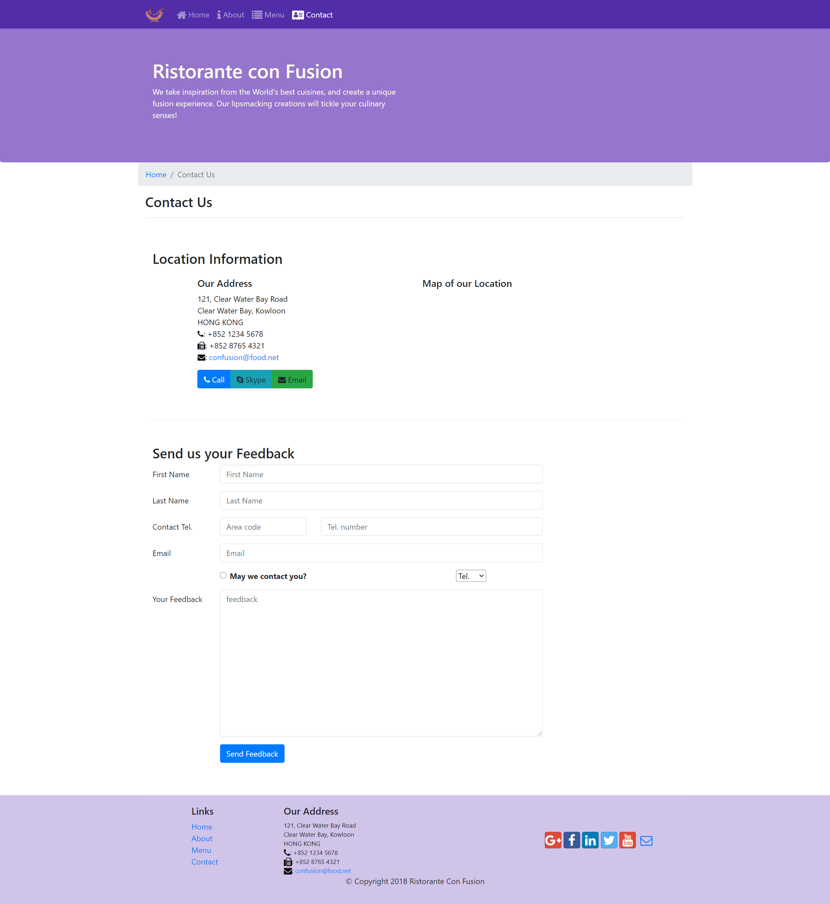
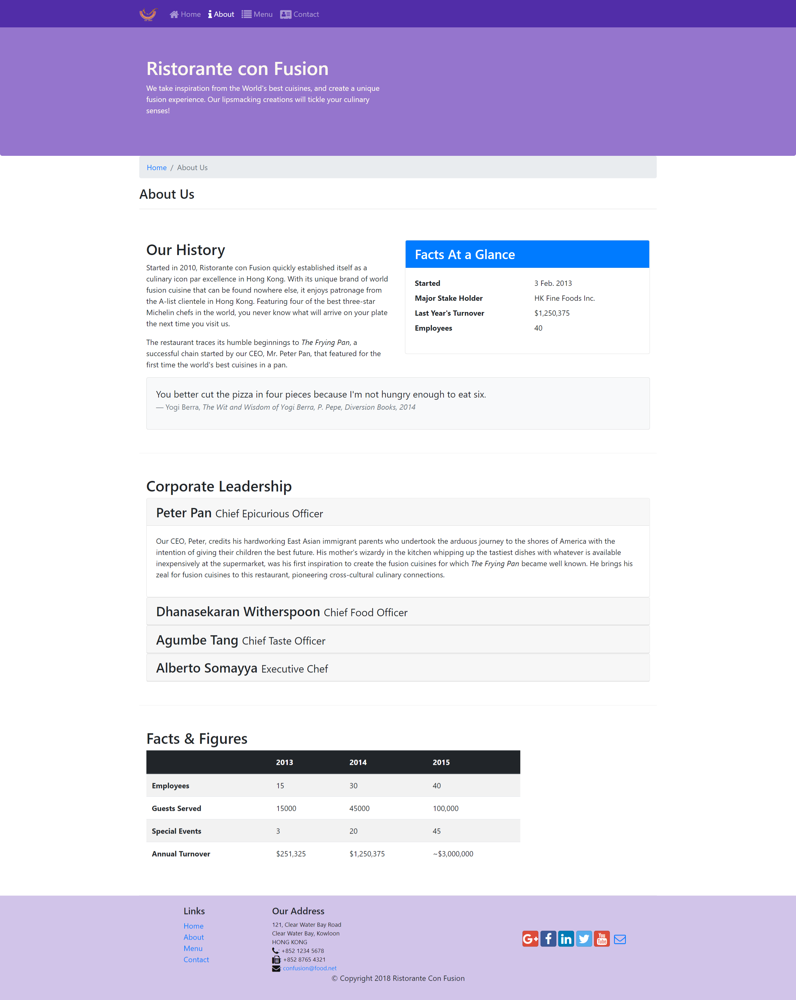

# Front-End-Web-UI-Frameworks-and-Tools-Bootstrap-4
Coursera Course : Front-End Web UI Frameworks and Tools: Bootstrap 4 by The Hong Kong University of Science and Technology 
Main Page:   
Contact Us Page:   
About Us Page:   
